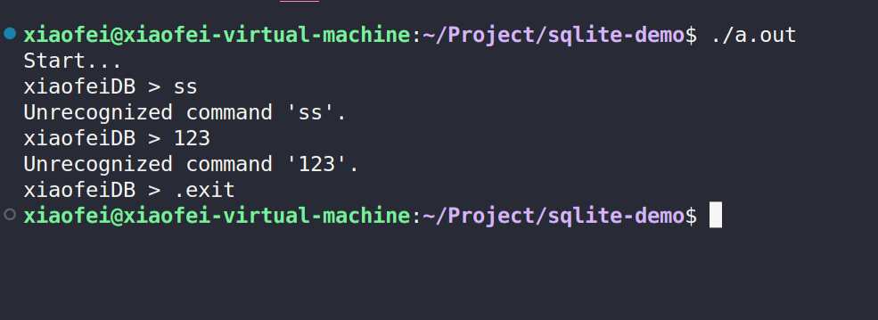
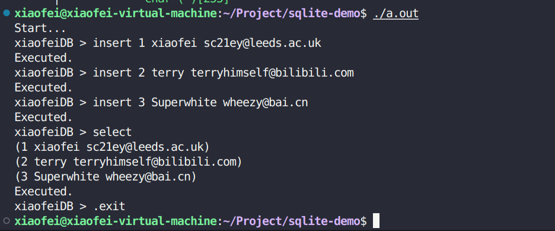

# xiaofeiDB - A simple database demo for **Sqlilite**

## Design of my Sqlite demo
The **front-end** consists of:
- tokenizer
- parser
- code generator

The **back-end** consists of:
- virtual machine
- B-tree
- pager
- os interface

## A simple REPL



## Single-table database
So far, xiaofeiDB supports two operations:
- insert a row
- print all rows out

**Data Structure**

It's very similar as Sqlite which uses B-tree for CRUD, However, for now, I use array instead of tree.

Each inserted row will be serialized and then compactly arranged in memory and stored like pages.
a page has many rows and a table has many pages. This structure is just like virtual memory systems in computer architectures.
```c
    void serialize_row(Row* source, void* destination) {
        memcpy(destination + ID_OFFSET, &(source->id), ID_SIZE);
        memcpy(destination + USERNAME_OFFSET, &(source->username), USERNAME_SIZE);
        memcpy(destination + EMAIL_OFFSET, &(source->email), EMAIL_SIZE);
    }
    void deserialize_row(void* source, Row* destination) {
        memcpy(&(destination->id), source + ID_OFFSET, ID_SIZE);
        memcpy(&(destination->username), source + USERNAME_OFFSET, USERNAME_SIZE);
        memcpy(&(destination->email), source + EMAIL_OFFSET, EMAIL_SIZE);
    }
```
**Search to write/read**

This function is how to figure out where to read/write in memory for a particular row:
```c
    void* row_slot(Table* table, uint32_t rows_num) {
    uint32_t page_num = rows_num / ROWS_PER_PAGE;
    void* page = table->pages[page_num];
    // if this page does not exist yet, init one
    if (page == NULL) {
        page = table->pages[page_num] = malloc(sizeof(PAGE_SIZE));
    }

    uint32_t row_offset = rows_num % ROWS_PER_PAGE;
    uint32_t byte_offset = row_offset * ROW_SIZE;

    return page + byte_offset;
}
```

**TEST**



## Deal with some bugs
**TODO**
- deal with the stackover
- deal with some invalid input like *negative id* or something

**FIX**
During test, when the input string is longer than the max length we set, `scanf()` will cause a buffer overflow and writing into a unexpected place. 

To fix that, I use `strtok()` to split the input buffer. Before storing the input string into Row model, checking the length of each string first to avoid buffer overflow and id validation